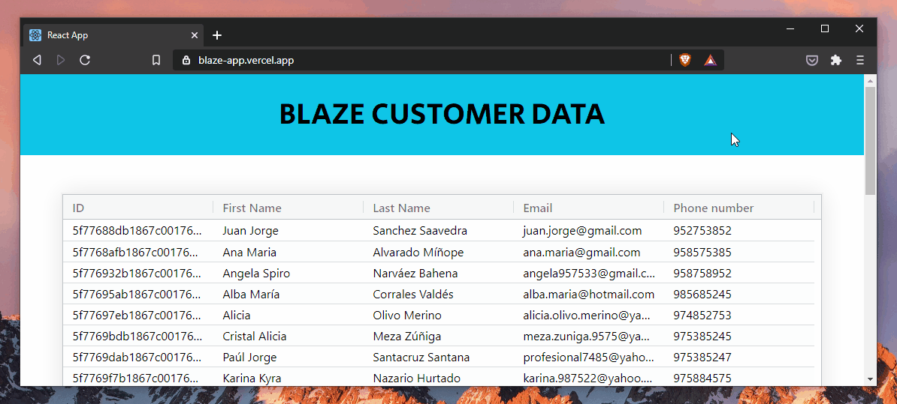
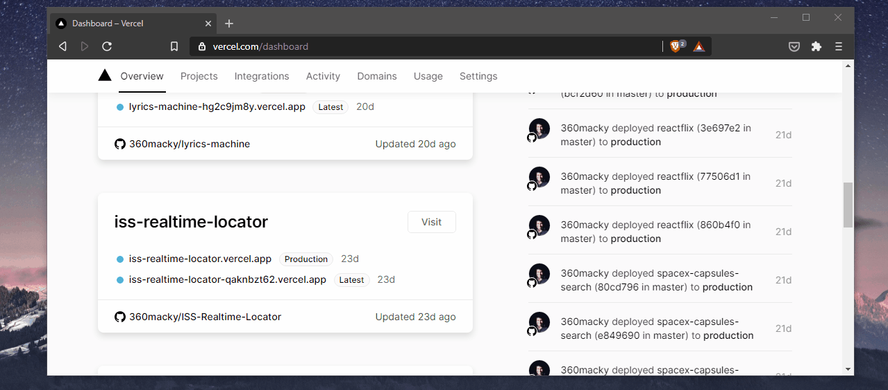

<h1 align="center"> Blaze React App </h1>

Challenge #1 of Blaze Engineering test

## 🚀 Deployment
Este es uno de los desafíos propuestos de Blaze. Donde programé una aplicación web desarrollada en ReactJS, usando una AG-Grid.

Para el despliegue de la demo usé **Vercel** (antes **Now.sh**).

